# Add Authentication to Your Agent

> **Goal:** Add Auth0 authentication to your working AI agent for secure user identification.
> **Estimated time:** 10 minutes

## Why Authentication Matters

Your agent currently works great with public tools, but has a critical limitation: **it doesn't know who you are**. Without user identity, your agent can't:

- Access personalized data (like your portfolio)
- Make user-specific decisions
- Maintain secure boundaries between users
- Provide truly personalized AI experiences

In this step, we'll solve this by adding Auth0 authentication, transforming your anonymous chatbot into a **personalized AI agent** that knows who it's helping.

## What we're building in this step

```mermaid
sequenceDiagram
    participant User as 👤 User
    participant Agent as 🤖 AI Agent<br/>:3003
    participant Auth0 as 🔐 Auth0 Tenant
    participant API as 📊 Stock API<br/>:3001
    
    User->>Agent: Visit http://localhost:3003
    Agent->>Agent: Middleware check: No session
    Agent->>Auth0: Redirect to /auth/login
    Auth0->>User: Show login form
    User->>Auth0: Enter credentials
    Auth0->>Agent: Callback with tokens
    Agent->>Agent: Store session
    Agent->>User: Show authenticated chat
    
    Note over Agent: Defense in depth:
    Note over Agent: Middleware + Page + API protection
    
    User->>Agent: "What's WAYNE stock price?"
    Agent->>API: getStockPrice('WAYNE')
    API->>Agent: $150.25
    Agent->>User: "WAYNE is $150.25"
```



**Security layers we're adding:**
- ✅ **Middleware protection** - Auth0 redirects for all routes
- ✅ **Server-side page protection** - `withPageAuthRequired()`
- ✅ **API route protection** - Session verification in chat endpoint
- 🔄 **Next:** Add portfolio tools with token delegation

## 1 – Test your current agent

Your agent works great with public tools but has no authentication:

```bash
cd apps/agent
pnpm dev  # starts on port 3003 (should already be running)
```

Open `http://localhost:3003` - anyone can use your agent! 🚨

**Security problem:** No user identity means no personalized data access.

---

## 2 – Create your Auth0 tenant

First, create your own Auth0 tenant for authentication:

Go to **https://auth0.ai** and create a new Auth0 tenant:

1. **Click "Sign Up"** if you don't have an Auth0 account
2. **Create a new tenant** - choose a unique tenant name (e.g., `yourname-workshop`)
3. **Select region** - Choose the region closest to you
4. **Note your tenant domain** - You'll need this (e.g., `yourname-workshop.us.auth0.com`)

> 📸 **Screenshot Placeholder**: Auth0 tenant creation process
> - Show the Auth0 signup/tenant creation interface
> - Highlight the tenant domain that gets generated

## 3 – Set up Auth0 CLI and initialize your tenant

Configure the Auth0 CLI and run the initialization script:

```bash
# Login to Auth0 CLI
auth0 login

# Select your newly created tenant when prompted
# Navigate to agent directory and run init script
cd auth0-agent
./init.sh
```

**What the init script does:**
- ✅ **Creates Management Client** - Auth0 client for Terraform
- ✅ **Runs Terraform** - Sets up API resource and agent application  
- ✅ **Generates Environment** - Creates `apps/agent/.env.local` file
- ✅ **Ready for authentication** - Prepared for the next steps

## 4 – Set up enterprise connection (for sign-in)

**Important:** You need to connect your tenant to the hosted DemoTradePro platform to enable sign-in.

**Option A: Use the developer tool (Recommended)**

Visit the hosted Stock Web App at `$STOCK_WEB_APP/developer` and:

1. **Enter your tenant domain** (e.g., `yourname-workshop.us.auth0.com`)
2. **Click "Generate OIDC Configuration"**
3. **Copy the generated `terraform.tfvars` content** 
4. **Add it to your `auth0-agent/terraform/terraform.tfvars` file**
5. **Run the connection script:**

> 📸 **Screenshot Placeholder**: Developer Tool Interface
> - Show the `$STOCK_WEB_APP/developer` page interface
> - Highlight the tenant domain input field
> - Show the "Generate OIDC Configuration" button
> 
> 📸 **Screenshot Placeholder**: Generated OIDC Configuration
> - Show the generated `terraform.tfvars` content that appears
> - Highlight the copy button or the configuration text area

```bash
cd auth0-agent
./add-oidc-connection.sh
```

**Option B: Manual configuration**

Alternatively, configure the enterprise connection manually in your Auth0 Dashboard:

1. Go to **Authentication > Enterprise > OpenID Connect**
2. Create a new OIDC connection pointing to the hosted DemoTradePro tenant
3. Configure the callback URLs and scopes

## 5 – Install NextJS Auth0 SDK

**Note:** The Auth0 SDK might already be installed from the init script. If so, you can skip this step.

Install or verify the Auth0 NextJS SDK (version 4.9.0 or higher):

```bash
cd apps/agent
pnpm add @auth0/nextjs-auth0@^4.9.0
```

---

## 6 – Set up Auth0 client configuration

Create the Auth0 client configuration. Copy the basic setup without the token helper (we'll add that later):

**Create `lib/auth0.ts`:**

```typescript
import { Auth0Client } from "@auth0/nextjs-auth0/server";

// Server-side Auth0 client instance
export const auth0 = new Auth0Client({
  authorizationParameters: {
    audience: process.env.AUTH0_AUDIENCE,
    scope: process.env.API_DEFAULT_SCOPES
  }
});
```

**What this does:**
- **Server-side client** - Handles authentication on the backend
- **Audience configuration** - Points to your stock trading API
- **Scope configuration** - Defines what permissions to request
- **Environment variables** - Keeps secrets secure

---

## 7 – Set up authentication middleware

Create middleware to protect all routes and adds the Auth0 route handlers such as /auth/login and /auth/logout.

**Create `middleware.ts` in the root of your agent app:**

```typescript
import type { NextRequest } from "next/server";
import { auth0 } from "./lib/auth0";

export async function middleware(request: NextRequest) {
  // Let Auth0 middleware handle authentication
  return await auth0.middleware(request);
}

export const config = {
  matcher: [
    /*
     * Protect ALL routes including root "/" - redirect to Auth0 login if not authenticated
     * Exclude only:
     * - _next/static (static files)
     * - _next/image (image optimization files) 
     * - favicon.ico, sitemap.xml, robots.txt (metadata files)
     */
    "/((?!_next/static|_next/image|favicon.ico|sitemap.xml|robots.txt).*)"
  ]
};
```

**What this does:**
- **Route protection** - Automatically protects all pages in your app
- **Static file exceptions** - Allows Next.js assets to load without auth
- **Defense in depth** - Works alongside page and API route protection

---

## 8 – Enable authentication in your page

Your template agent currently bypasses authentication. Let's enable it!

**Update `app/page.tsx` to use real authentication:**

```typescript
import { auth0 } from "../lib/auth0";
import ChatClient from './components/chat-client';

export default auth0.withPageAuthRequired(
  async function Chat() {
    const session = await auth0.getSession();
    const user = session?.user;

    return <ChatClient user={user} />;
  },
  { returnTo: "/" }
);
```

**What this does:**
- **Server-side auth check** - Verifies user is authenticated before page renders
- **Automatic redirect** - Sends unauthenticated users to Auth0 login
- **Clean and simple** - Just wrap your existing component!

---

## 9 – Update your API route to use authentication

Your agent's API route needs to verify user identity. **Replace the entire contents of `app/api/chat/route.ts` with:**

```typescript
import { openai } from '@ai-sdk/openai';
import { streamText, UIMessage, convertToModelMessages, stepCountIs } from 'ai';
import { auth0 } from '../../../lib/auth0';
import { NextResponse } from 'next/server';
import { agentTools } from './tools';

// Allow streaming responses up to 30 seconds
export const maxDuration = 30;

export async function POST(req: Request) {
  // Verify user is authenticated
  const session = await auth0.getSession();
  if (!session || !session.user) {
    return NextResponse.json({ error: 'Unauthorized' }, { status: 401 });
  }

  const { messages }: { messages: UIMessage[] } = await req.json();
  const user = session.user;

  const result = streamText({
    model: openai('gpt-4o'),
    messages: convertToModelMessages(messages),
    system: `You are a helpful stock trading assistant for DemoTradePro. You provide trading advice, market insights, and help users understand stock market concepts. You are knowledgeable, professional, and always emphasize risk management.

You are currently assisting ${user.name || 'a user'} (${user.email || 'authenticated user'}).

Key guidelines:
- Always remind users that trading involves risk
- Provide educational information about stocks and markets
- Help with basic trading concepts and strategies
- Be conversational and helpful
- Never provide specific financial advice or guarantees
- You can reference the user by their name when appropriate

You now have access to real-time stock market data through your tools. Use them when users ask about stock prices, company information, or want to search for stocks.`,
    tools: agentTools,
    stopWhen: stepCountIs(15),
  });

  return result.toUIMessageStreamResponse();
}
```

**Key changes:**
- **Authentication check** - Verifies user session before processing
- **Personalized system prompt** - AI knows the user's name and email
- **Tools included** - Your public stock tools still work!
- **401 Unauthorized** - Clear error response for invalid sessions

---

## 5 – Test your authenticated agent

Restart your development server:

```bash
pnpm dev
```

Visit `http://localhost:3003`:

1. **Automatic redirect** to Auth0 login
2. **After login** - redirected back to chat
3. **Test stock tools:** "What's the current price of WAYNE stock?"
4. **Personalized response** - AI should greet you by name!

---

## ✅ Success! Multi-Layer Security

**Your agent now has defense-in-depth security:**
- ✅ **Middleware protection** - Redirects to Auth0 if not authenticated
- ✅ **Page-level protection** - Server-side auth verification
- ✅ **API route protection** - Chat endpoint requires valid session
- ✅ **Personalized AI** - Agent knows who you are
- ✅ **Tools still work** - Public stock data access maintained

> 📸 **Screenshot Placeholder**: Authenticated Agent in Action
> - Show the agent interface at `http://localhost:3003` after successful authentication
> - Display a user profile/session indicator
> - Show the agent responding to a query while authenticated
> - Highlight any user-specific elements in the interface

**What you've built:**
- ✅ Secure AI agent with user identity
- ✅ Auth0 integration with proper token handling
- ✅ Public stock tools working with authentication
- 🔄 **Next:** Add portfolio tools with token delegation

**Security problem solved:** Your agent now knows who's using it and can provide personalized responses while maintaining access to public stock data.
- ✅ **Complete security** - No unauthorized access to any part of the application
- ✅ **Sign out works** - Redirects to Auth0 logout and clears session

---

## 🛠️ Troubleshooting

**Login redirect issues:** Check that your Auth0 application has `http://localhost:3003/auth/callback` in the allowed callback URLs (note: `/auth/callback`, not `/api/auth/callback`).

**Environment variable errors:** Ensure you ran `auth0-agent/init.sh` and have all Auth0 environment variables set in `.env.local`.

---

## 📚 Key Auth0 v4 SDK Facts

- **No `handleAuth()` function** - This was removed in v4
- **No API route files needed** - Middleware provides `/auth/login`, `/auth/logout`, `/auth/callback` automatically  
- **Middleware is required** - `auth0.middleware()` handles all authentication
- **Official docs:** https://auth0.com/docs/quickstart/webapp/nextjs/01-login

---

## 🎯 What's Next?

**You now have:** Fully secured AI agent with complete authentication!

**Security Achievement:**
- 🔒 **Defense in depth** - Middleware + page + API protection
- 👤 **User identity** - AI knows who you are and personalizes responses
- 🚫 **Zero unauthorized access** - Every entry point requires Auth0 authentication

**But there's a problem:** How does your agent access *your* portfolio data from the API?

**Coming up:** We'll add tools that can fetch your personal data... and discover why this creates a dangerous security temptation! 🚨
