# Add Authenticated Tools to Your Agent

> **Goal:** Add portfolio access so your agent can fetch user-specific trading data using token delegation.
> **Estimated time:** 8 minutes

## What we're building in this step

```mermaid
sequenceDiagram
    participant User as 👤 User (Alice)
    participant Agent as 🤖 AI Agent<br/>:3003
    participant Auth0 as 🔐 Auth0 Tenant<br/>(Token Vault)
    participant API as 📊 Stock API<br/>:3001
    participant DB as 🗄️ Database
    
    User->>Agent: "Show me my portfolio"
    Agent->>Agent: Extract user from session
    Agent->>Auth0: getDelegatedAccessToken()<br/>(OIDC connection)
    Auth0->>Auth0: Exchange user token<br/>for API access token
    Auth0->>Agent: Scoped access token<br/>(5min TTL)
    Agent->>API: getPortfolio()<br/>with delegated token
    API->>API: Validate JWT + extract userId
    API->>DB: SELECT * FROM portfolio<br/>WHERE userId = 'alice'
    DB->>API: Alice's portfolio data
    API->>Agent: Portfolio response
    Agent->>User: "You own 100 WAYNE shares..."
    
    Note over Auth0: Token Vault = secure<br/>token exchange (OBO)
    Note over API: User isolation via<br/>JWT claims
```



**Secure token flow we're adding:**
- ✅ **Token delegation** - Exchange user tokens for API tokens
- ✅ **User isolation** - Portfolio data scoped to authenticated user
- ✅ **Short-lived tokens** - 5-minute TTL (not root keys)
- ✅ **Portfolio tools** - `getPortfolio`, `getOrderHistory`, `createOrder`

## 1 – Test your current agent

Your authenticated agent can fetch public stock data but not personal portfolio info:

```bash
cd apps/agent
pnpm dev  # starts on port 3003
```

Open `http://localhost:3003` and ask: *"Show me my portfolio"*

**Current response:** *"I don't have access to your portfolio data..."* 🤷‍♂️

---

## 2 – Add token delegation helper

**Key concept:** Your agent needs to exchange the user's Auth0 token for an API access token.

Add this function to your existing `lib/auth0.ts`:

```typescript
/**
 * Helper to get delegated access token for the API
 * Uses the OIDC connection to get a token for the stock trading API
 */
export async function getAccessTokenForConnection({ connection }: { connection: string }): Promise<string | undefined> {
  try {

    if (!auth0.getSession()) {
      return undefined;
    }


    const token = await auth0.getAccessTokenForConnection({ connection });

    if (!token.token) {
      throw new Error("Access token is not available in Auth0 Token Vault");
    }

    return token.token;

  } catch (error) {

    console.error('Failed to get stored access token:', error);
    throw error;
  }
}
```

**Replace `<CONNECTION_NAME>`** with your OIDC connection identifier.

---

## 3 – Add authenticated tools

Update your `app/api/chat/tools.ts` to add portfolio access:

```typescript
// Add these imports to your existing tools.ts
import * as GetPortfolio from '@workspace/agent-utils/tools/get-portfolio';
import { getAccessTokenForConnection } from '@/lib/auth0';

// Update your API client to include token provider for authenticated calls
const apiClient = createAPIClient(process.env.API_BASE_URL!, async () => {
  const token = await getAccessTokenForConnection({ connection: 'DEMO_TRADE_PRO' });
  return token;
});

// Update your existing public tools to use the shared API client
export const publicStockTools = {
  getStockPrice: GetStockPrice.createAISDKTool(apiClient),
  searchStocks: SearchStocks.createAISDKTool(apiClient),
  getStockInfo: GetStockInfo.createAISDKTool(apiClient),
} as const;

// Add authenticated tools using the same API client
export const authenticatedTools = {
  getPortfolio: GetPortfolio.createAISDKTool(apiClient),
} as const;

// Update your agentTools to include authenticated tools
export const agentTools = {
  ...publicStockTools,     // your existing public tools
  ...authenticatedTools,   // new authenticated tools
} as const;
```

## 4 – Test authenticated access

Restart your agent and test the new functionality:

```bash
pnpm dev
```

Now ask: *"Show me my current portfolio"*

**Expected response:** Your agent should now fetch and display your actual portfolio data! 🎉

---

## How token delegation works

1. **User Authentication**: User logs in through Auth0 middleware
2. **Token Exchange**: `getDelegatedAccessToken()` exchanges the user's session for an API token
3. **Scoped Access**: The API receives a token with user context and appropriate scopes
4. **Secure Calls**: Agent makes authenticated requests on behalf of the user

**Security benefit:** No root API keys, only user-scoped tokens with limited lifetime.

---

## Try these prompts

- *"What stocks do I currently own?"*
- *"What's the total value of my portfolio?"*
- *"Show me my APPLE holdings and current price"*

---

## Next: Add more authenticated tools

Extend `authenticatedTools` with additional personal data access:

```typescript
import * as GetOrderHistory from '@workspace/agent-utils/tools/get-order-history';
import * as CreateOrder from '@workspace/agent-utils/tools/create-order';

// All tools share the same API client with token provider
export const authenticatedTools = {
  getPortfolio: GetPortfolio.createAISDKTool(apiClient),
  getOrderHistory: GetOrderHistory.createAISDKTool(apiClient),
  createOrder: CreateOrder.createAISDKTool(apiClient),
} as const;
```

**Available authenticated tools:**
- `get-portfolio` - Current holdings
- `get-order-history` - Past transactions  
- `get-order-status` - Order tracking
- `create-order` - Place trades
