# Add Public Tools to Your Agent

> **Goal:** Add stock price fetching tools so your agent can access public DemoTradePro market data.
> **Estimated time:** 12 minutes

## What we're building in this step

```mermaid
graph TB
    subgraph "Public Tools Added"
        User[👤 User]
        Agent[🤖 AI Agent<br/>:3003]
        API[📊 Stock API<br/>:3001]
        Tools[🔧 Public Tools<br/>@workspace/agent-utils]
    end
    
    User --> |"What's WAYNE stock price?"| Agent
    Agent --> |"getStockPrice('WAYNE')"| Tools
    Tools --> |"Fetch public data"| API
    API --> |"$150.25"| Tools
    Tools --> Agent
    Agent --> |"WAYNE is trading at $150.25"| User
    
    classDef active fill:#e8f5e8
    classDef tools fill:#fff3e0
    
    class User,Agent,API active
    class Tools tools
```



**Tools we're adding:**
- ✅ `getStockPrice` - Get current stock price
- ✅ `searchStocks` - Find companies by name/symbol
- ✅ `getStockInfo` - Get company details
- 🔄 **Next:** Add authentication for user identity

## 1 – Test your template agent

Your template agent provides trading advice but can't fetch real stock data:

```bash
cd apps/agent
pnpm dev  # starts on port 3003 (should already be running)
```

Open `http://localhost:3003` and ask: *"What's the current price of WAYNE stock?"*

**Current response:** *"I don't have access to real-time stock data..."* 🤷‍♂️

## 2 – Check what's already set up

Your template agent already has all dependencies installed:
- ✅ `ai` - AI SDK v5 with streamText
- ✅ `@ai-sdk/openai` - OpenAI provider
- ✅ `@workspace/agent-utils` - Shared tools package
- ✅ Working chat interface with useChat hook
- ✅ Empty tools configuration ready for your code

## 3 – Add tools to your empty configuration

Your workshop includes a **shared tools package** at `@workspace/agent-utils` with pre-built tools.

**Why shared tools?** Same tool definitions work with both AI SDK and MCP servers (you'll see this later!).

Your agent already has an empty tools configuration at `app/api/chat/tools.ts`. Let's add the public stock tools:

```typescript
/**
 * DemoTradePro Agent Tools Configuration
 * Centralized tool definitions for the chat agent
 */

import * as GetStockPrice from '@workspace/agent-utils/tools/get-stock-price';
import * as SearchStocks from '@workspace/agent-utils/tools/search-stocks';
import * as GetStockInfo from '@workspace/agent-utils/tools/get-stock-info';
import { createAPIClient } from '@workspace/agent-utils';

/**
 * Create shared API client for public endpoints
 * No token provider needed for public market data
 */
const apiClient = createAPIClient(process.env.API_BASE_URL!);

/**
 * Public stock market tools - no authentication required
 */
export const publicStockTools = {
  getStockPrice: GetStockPrice.createAISDKTool(apiClient),
  searchStocks: SearchStocks.createAISDKTool(apiClient),
  getStockInfo: GetStockInfo.createAISDKTool(apiClient),
} as const;

/**
 * All available tools for the agent
 * Currently only includes public tools - authenticated tools will be added later
 */
export const agentTools = {
  ...publicStockTools,
} as const;
```

**What these tools do:**
- ✅ `getStockPrice` - Get current price for any stock symbol
- ✅ `searchStocks` - Find stocks by company name
- ✅ `getStockInfo` - Get detailed company information
- ✅ **No authentication needed** - Public market data!

## 4 – Update your agent to use the tools

Your template agent already has a working API route at `app/api/chat/route.ts`, but it's not using any tools yet. Let's update it to use your tools configuration.

**Replace the entire contents of `app/api/chat/route.ts` with:**

```typescript
import { openai } from '@ai-sdk/openai';
import { streamText, UIMessage, convertToModelMessages, stepCountIs } from 'ai';
import { agentTools } from './tools';

// Allow streaming responses up to 30 seconds
export const maxDuration = 30;

export async function POST(req: Request) {
  const { messages }: { messages: UIMessage[] } = await req.json();

  const result = streamText({
    model: openai('gpt-4o'),
    messages: convertToModelMessages(messages),
    system: `You are a helpful stock trading assistant for DemoTradePro. You provide trading advice, market insights, and help users understand stock market concepts. You are knowledgeable, professional, and always emphasize risk management.

You are currently assisting a user.

Key guidelines:
- Always remind users that trading involves risk
- Provide educational information about stocks and markets
- Help with basic trading concepts and strategies
- Be conversational and helpful
- Never provide specific financial advice or guarantees
- You can reference the user by their name when appropriate

You now have access to real-time stock market data through your tools. Use them when users ask about stock prices, company information, or want to search for stocks.`,
    tools: agentTools,
    stopWhen: stepCountIs(15),
  });

  return result.toUIMessageStreamResponse();
}
```

**Key changes:**
- **Clean import:** Single import `{ agentTools } from './tools'`
- **Simple tools:** Just `tools: agentTools,` - much cleaner!
- **Centralized config:** All tools managed in one place
- **Ready for expansion:** Easy to add more tools later

## 5 – Test your enhanced agent

**Your agent already has a beautiful chat UI!** Now let's test the stock tools.

Restart your development server to pick up the new tools:

```bash
# Kill the current process (Ctrl+C) then restart
pnpm dev
```

**Test these prompts:**

1. **Stock price:** *"What's the current price of WAYNE stock?"*
   - Should call `getStockPrice` tool and show real price data!

2. **Company search:** *"Find me information about Stark Industries"*
   - Should use `searchStocks` and `getStockInfo` tools

3. **General trading:** *"What's your role?"*
   - Should work as before (trading advice)

**Expected behavior:**
- Agent will pause, call the appropriate tool
- Show real stock data from DemoTradePro API
- Provide insights about the companies

---

## 🎉 Success! Public Data Works Great

Your agent now has **public stock data access** and it works perfectly!

**What you've built:**
- ✅ Working AI SDK v5 agent with tools
- ✅ Real-time stock price fetching
- ✅ Company information lookup
- ✅ Clean shared tools architecture
- ✅ **No authentication needed** - public data is safe!

**Try these test prompts:**
- *"What's WAYNE trading at today?"*
- *"Tell me about Stark Industries"*
- *"Search for companies with 'Wayne' in the name"*

---

## 🤔 But What About Personal Data?

Now try asking: *"What's in my portfolio?"* or *"What stocks do I own?"*

**Agent response:** *"I don't have access to your personal portfolio data..."*

**The problem:** Your agent can fetch public data, but has no way to know **who you are** or access **your personal** trading data.

**Coming up:** We'll add authentication so your agent knows your identity and can access your personal portfolio! 🔐
