# Welcome

Hello Workshop Atendee, or Internet User, 

Auth0 is a Developer Platform, and we provide tooling so developers and companies can build tools we all love and use everyday, securely. 

In this workshop, you'll build an AI Agent, AI-native service that can be easily integrated into various AI workflows. Complete with an Agent, and MCP Server, all secured by Auth0.

**DemoTradePro Agent Workshop**

In this hands-on session you'll build an AI agent that can trade on your behalf—securely.

## Story 

DemoTradePro Corp offers a fictional Stock Trading for fictional universes. Due to the increasing demand in AI Agents, and Agentic web they have determined that they must 

### Existing Components 

For the purpose of this workshop we will use shared services that are provided to us, these mimic how companies have deployed applications today

* [Web Application](https://workshop-web-app.auth101.dev) this web application itself that end-users can use.
* [API Server](https://workshop-stock-api.auth101.dev) this API Server hosts the business logic for the api.
* [Identity Provider](https://workshop-stock-idp.auth101.dev) this is the Identity Provider for Demo Trade Pro services

## Repeatable Pattern

You'll learn a **repeatable pattern** that can be applied to any API or service, and existing apps weather or not 

1. **Start with a basic chatbot** - Simple AI conversation interface
2. **Add public tools** - Connect to DemoTradePRO API Endpoints that don't require authentication
3. **Add user authentication** - Make the agent aware of who's using it
4. **Add authenticated tools** - Access user-specific, securely
5. **Package as MCP Server** - Wrap everything into a reusable component which can also be used by Claude, Cursor or any AI Agent.

While we're using DemoTradePro as our example, the final agent architecture you'll build can sit **in front of any existing API**. The authentication patterns, tool calling mechanisms, and MCP packaging you'll learn here are universally applicable.

 By the end of this workshop, you'll have a functioning agent for turning any API into an AI-native service that can be easily integrated into various AI workflows.

## Complete Architecture Overview

```mermaid
graph TB
    subgraph "DemoTradePro Ecosystem"
        User[👤 Workshop Participant]
        
        subgraph "Auth0 Security Layer"
            Auth0[🔐 Auth0 Tenant<br/>Token Vault + OIDC]
        end
        
        subgraph "AI Agent (Port 3003)"
            Agent[🤖 AI Agent<br/>AI SDK v5 + GPT-4.1-mini]
            Tools[🔧 Trading Tools<br/>@workspace/agent-utils]
        end
        
        subgraph "DemoTradePro Platform"
            Web[🌐 Trading Web<br/>:3000]
            API[📊 Stock API<br/>:3001]
            DB[(🗄️ PostgreSQL<br/>User portfolios)]
        end
        
        subgraph "Workshop Documentation"
            Docs[📚 Workshop Docs]
        end
    end
    
    User --> Docs
    User --> Agent
    User --> Web
    
    Agent --> Auth0
    Web --> Auth0
    
    Auth0 --> |"Token delegation<br/>(OBO flow)"| API
    Agent --> |"Authenticated tools"| Tools
    Tools --> |"Delegated tokens"| API
    Web --> |"Direct auth"| API
    
    API --> DB
    
    classDef security fill:#ffe6e6
    classDef agent fill:#e6f3ff
    classDef platform fill:#e6ffe6
    classDef docs fill:#fff3e6
    
    class Auth0 security
    class Agent,Tools agent
    class Web,API,DB platform
    class Docs docs
```

## Key Security Concepts

- ⏱️ **Leveraging Short-lived tokens** - 5-minute TTL for minimal blast radius
- 🔐 **Token Vault** - Secure token exchange instead keys that grant broad access
- 🔄 **On-Behalf-Of (OBO)** - User tokens → API tokens

## Prerequisites

This workshop leverages Typescript and the Vercel AI SDK, the final agent can be deployed to Vercel. All the necessary tools, and libraries are included in your [starter kit](https://github.com/ciamshrek/demo-trade-pro) and will automatically be installed, but we require 3 dependencies

- Node.js (LTS 22 is preferred) 
- PNPM (optional)
- Auth0 CLI
- Terraform 

If you are having trouble installing these please consult the helpers in the workshop.

---

Use the sidebar to begin with **Local Setup** →
