# Welcome

**DemoTradePro Agent Workshop**

In this hands-on session you'll build an AI agent that can trade on your behalf—securely.

## Complete Architecture Overview

```mermaid
graph TB
    subgraph "DemoTradePro Ecosystem"
        User[👤 Workshop Participant]
        
        subgraph "Auth0 Security Layer"
            Auth0[🔐 Auth0 Tenant<br/>Token Vault + OIDC]
        end
        
        subgraph "AI Agent (Port 3003)"
            Agent[🤖 AI Agent<br/>AI SDK v5 + GPT-4o]
            Tools[🔧 Trading Tools<br/>@workspace/agent-utils]
        end
        
        subgraph "DemoTradePro Platform"
            Web[🌐 Trading Web<br/>:3000]
            API[📊 Stock API<br/>:3001]
            DB[(🗄️ PostgreSQL<br/>User portfolios)]
        end
        
        subgraph "Workshop Documentation"
            Docs[📚 Workshop Docs<br/>:3002]
        end
    end
    
    User --> Docs
    User --> Agent
    User --> Web
    
    Agent --> Auth0
    Web --> Auth0
    
    Auth0 --> |"Token delegation<br/>(OBO flow)"| API
    Agent --> |"Authenticated tools"| Tools
    Tools --> |"Delegated tokens"| API
    Web --> |"Direct auth"| API
    
    API --> DB
    
    classDef security fill:#ffe6e6
    classDef agent fill:#e6f3ff
    classDef platform fill:#e6ffe6
    classDef docs fill:#fff3e6
    
    class Auth0 security
    class Agent,Tools agent
    class Web,API,DB platform
    class Docs docs
```

## What you'll learn

1. **Local Setup** – Clone the repo, bootstrap Auth0, run the stock web + API
2. **Add Public Tools** – Give your agent stock price fetching capabilities  
3. **Add Authentication** – Secure your agent with Auth0 user identification
4. **Add Authenticated Tools** – Portfolio access with token delegation

## Key Security Concepts

- 🔐 **Token Vault** - Secure token exchange instead of root keys
- ⏱️ **Short-lived tokens** - 5-minute TTL for minimal blast radius
- 🔄 **On-Behalf-Of (OBO)** - User tokens → API tokens
- 🏦 **User isolation** - Portfolio data scoped to authenticated user
- 🛡️ **Defense in depth** - Middleware + page + API protection

## Prerequisites

- Node.js LTS (managed with `nvm`)
- PNPM package manager
- Docker Desktop
- Auth0 CLI

## Time estimate

**30 minutes** focused workshop:
- Setup (8 min) + Public Tools (12 min) + Authentication (10 min)

---

Use the sidebar to begin with **Local Setup** →
