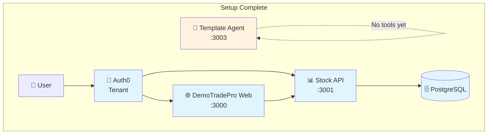

# Local Setup

> **Estimated time:** 10 minutes

## What we're building in this step



**By the end of this step:**
- ✅ Template AI agent running (no authentication yet)
- ✅ Access to hosted DemoTradePro platform for later tutorials
- ✅ Ready to add tools and authentication
- 🔄 **Next:** Add public stock tools to your agent

## Prerequisites

* `nvm` with Node **LTS** (run `nvm use lts` or `nvm use --lts`)
* **PNPM** package manager
* **OpenAI API key** (get one at https://platform.openai.com/)

### Using hosted DemoTradePro platform

**Great news!** We provide hosted Stock API and Trader Web App so you can focus on building your agent:

- 🌐 **Stock Web App**: Available at hosted URL (provided during workshop)
- 📊 **Stock API**: Available at hosted URL (provides real market data)
- 🔐 **Authentication**: You'll set this up in a later tutorial

---

## 1 – Clone the workshop repository

```bash
git clone https://github.com/ciamshrek/demo-trade-pro.git
cd demo-trade-pro
nvm use --lts     # critical requirement
pnpm install      # install dependencies
```

## 2 – Start your template agent

```bash
cd apps/agent
echo "OPENAI_API_KEY=your_key_here" >> .env.local  # Add your OpenAI key
pnpm dev  # starts on port 3003
```

**Test your template agent:**
1. **Open** `http://localhost:3003`
2. **Ask:** "What's the current price of WAYNE stock?"
3. **Expected response:** *"I don't have access to real-time stock data..."* 🤷‍♂️

**Perfect!** Your agent provides trading advice but has no tools or authentication yet.

🎉 **Success!** Your template agent is running, ready for tools and authentication!

---

## What's included

Your workshop starter includes:
- **`apps/web`** - Full DemoTradePro trading interface (port 3000)
- **`apps/api-server`** - REST API with JWT validation (port 3001)
- **`apps/agent`** - Template AI agent with no tools (port 3003)
- **`apps/docs`** - This workshop documentation (port 3002)
- **`packages/agent-utils`** - Shared tools package (we'll use this next!)

🚀 **Ready for the next step:** Adding public stock tools to your agent!
