# Local Setup

> **Estimated time:** 10 minutes

## What we're building in this step

```mermaid
graph TB
    subgraph "Setup Complete"
        User[👤 User]
        Auth0[🔐 Auth0<br/>Tenant]
        Agent[🤖 Template Agent<br/>:3003]
        API[📊 Stock API<br/>:3001]
        Web[🌐 DemoTradePro Web<br/>:3000]
        DB[(🗄️ PostgreSQL)]
    end
    
    User --> Auth0
    Auth0 --> Web
    Auth0 --> API
    Agent -.-> |"No tools yet"| Agent
    Web --> API
    API --> DB
    
    classDef setup fill:#e1f5fe
    classDef pending fill:#fff3e0
    
    class Auth0,API,Web,DB setup
    class Agent pending
```



**By the end of this step:**
- ✅ AI agent running
- ✅ Ready to add tools and authentication
- 🔄 **Next:** Add public stock tools to your agent

## Prerequisites

* **OpenAI API key** (get one at https://platform.openai.com/) or any other AI Key

## 1 – Clone the workshop repository

First lets clone the git repository, so that we can get template and all the utilities for the workshop

```bash
git clone https://github.com/ciamshrek/demo-trade-pro.git
cd demo-trade-pro
nvm use           # if using nvm
pnpm install      # install dependencies
```

## 2 – Start your template agent

Now lets add the OpenAI Keys, and run the agent

```bash
cd apps/agent
echo "OPENAI_API_KEY=your_key_here" >> .env.local  # Add your OpenAI key
pnpm dev  # starts on port 3003
```

**Test your template agent:**

At this point your template agent is fully functional and running

1. **Open** `http://localhost:3003`
2. **Ask:** "What's the current price of WAYNE stock?"
3. **Expected response:** *"I don't have access to real-time stock data..."* 🤷‍♂️

**Perfect!** Your agent provides trading advice but has no tools or authentication yet.

🎉 **Success!** Your template agent is running, ready for tools and authentication!

---

## Overview of what's included in your starter kit

This starter kit is a monorepo which includes 

- **`apps/agent`** - Template AI agent with no tools (port 3003)
- **`packages/agent-utils`** - Shared tools package (we'll use this next!)
- **`packages/ui`** - Prebuilt UI Components

🚀 **Ready for the next step:** Adding public stock tools to your agent!
