# Local Setup

> **Estimated time:** 10 minutes

## What we're building in this step

```mermaid
graph TB
    subgraph "Setup Complete"
        User[👤 User]
        Auth0[🔐 Auth0<br/>Tenant]
        Agent[🤖 Template Agent<br/>:3003]
        API[📊 Stock API<br/>:3001]
        Web[🌐 DemoTradePro Web<br/>:3000]
        DB[(🗄️ PostgreSQL)]
    end
    
    User --> Auth0
    Auth0 --> Web
    Auth0 --> API
    Agent -.-> |"No tools yet"| Agent
    Web --> API
    API --> DB
    
    classDef setup fill:#e1f5fe
    classDef pending fill:#fff3e0
    
    class Auth0,API,Web,DB setup
    class Agent pending
```



**By the end of this step:**
- ✅ Auth0 tenant configured with API + Web client
- ✅ DemoTradePro platform running (Web + API + Database)
- ✅ Template AI agent running (no tools yet)
- 🔄 **Next:** Add public stock tools to your agent

## Prerequisites

* `nvm` with Node **LTS** (run `nvm use --lts`)
* **PNPM** package manager
* Docker Desktop (only if you plan to run the API locally)
* Auth0 CLI (`brew install auth0/tap/auth0`)

### Hosted quick-start

Organizers run a **shared Stock API & Web** at `SHARED_API_URL` / `SHARED_WEB_URL` (provided day-of). If those environment variables are present you can **skip steps 2–4** and go straight to building the agent:

```bash
export NEXT_PUBLIC_API_BASE=$SHARED_API_URL   # e.g. https://api.stocktrade.ai
export AUTH0_BASE_URL=$SHARED_WEB_URL         # e.g. https://web.stocktrade.ai
```

Then run the docs commands as usual; the agent will call the hosted API.

---

## 1 – Clone the repo

```bash
git clone https://github.com/ciamshrek/demo-trade-pro.git
cd demo-trade-pro
```

## 2 – Install deps & spin up database

```bash
nvm use --lts     # critical per workshop requirement
pnpm install      # monorepo deps
docker-compose up -d  # starts postgres
```

## 3 – Bootstrap Auth0

```bash
cd auth0
./scripts/generate-auth-management-client.sh   # writes terraform.tfvars
terraform -chdir=terraform apply              # creates API + Web client
./scripts/generate-web-env.sh                 # apps/web/.env.local
./scripts/generate-api-env.sh                 # apps/api-server/.env
```

## 4 – Run baseline apps

```bash
# Terminal 1: API server on port 3001
cd apps/api-server && pnpm dev

# Terminal 2: Web app on port 3000
cd apps/web && pnpm dev
```

## 5 – Validate the DemoTradePro platform

1. **Open** `http://localhost:3000`
2. **Click "Sign In"** - you'll be redirected to Auth0
3. **Create an account** or sign in
4. **View your portfolio** - should show sample stocks (WAYNE, STARK, etc.)
5. **Test trading** - place a small order to verify the API works

## 6 – Set up your template agent

Bootstrap your agent tenant and start the template:

```bash
# Terminal 3: Agent setup
cd auth0-agent
./init.sh                    # creates Auth0 agent tenant + generates .env.local

# Terminal 4: Start template agent
cd apps/agent
echo "OPENAI_API_KEY=your_key_here" >> .env.local  # Add your OpenAI key
pnpm dev                     # starts on port 3003
```

**Test your template agent:**
1. **Open** `http://localhost:3003`
2. **Ask:** "What's the current price of WAYNE stock?"
3. **Expected response:** *"I don't have access to real-time stock data..."* 🤷‍♂️

**Perfect!** Your template agent provides trading advice but has no tools yet.

🎉 **Success!** You now have both DemoTradePro platform AND template agent running.

---

## What's included

Your workshop starter includes:
- **`apps/web`** - Full DemoTradePro trading interface (port 3000)
- **`apps/api-server`** - REST API with JWT validation (port 3001)
- **`apps/agent`** - Template AI agent with no tools (port 3003)
- **`apps/docs`** - This workshop documentation (port 3002)
- **`packages/agent-utils`** - Shared tools package (we'll use this next!)

🚀 **Ready for the next step:** Adding public stock tools to your agent!
